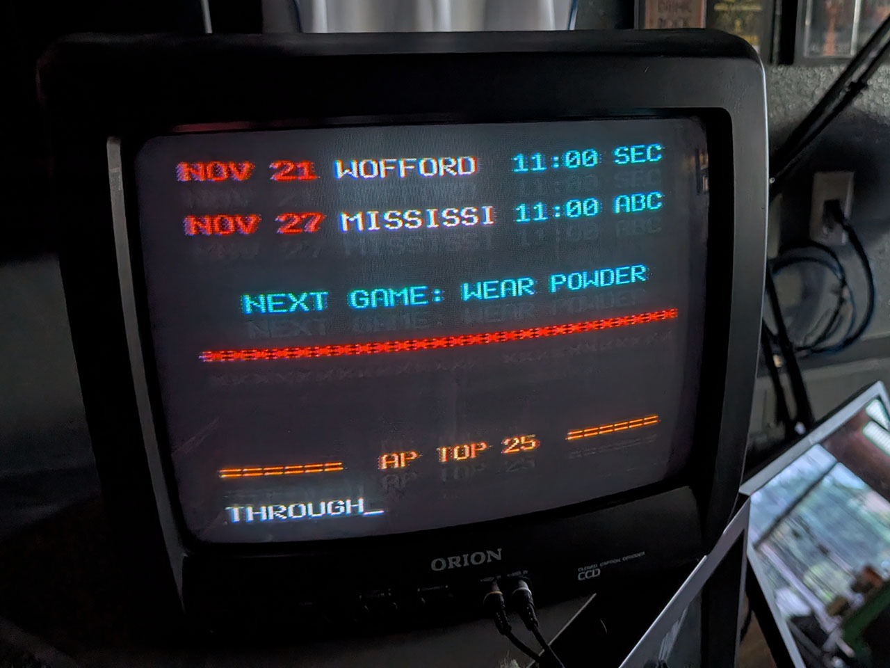
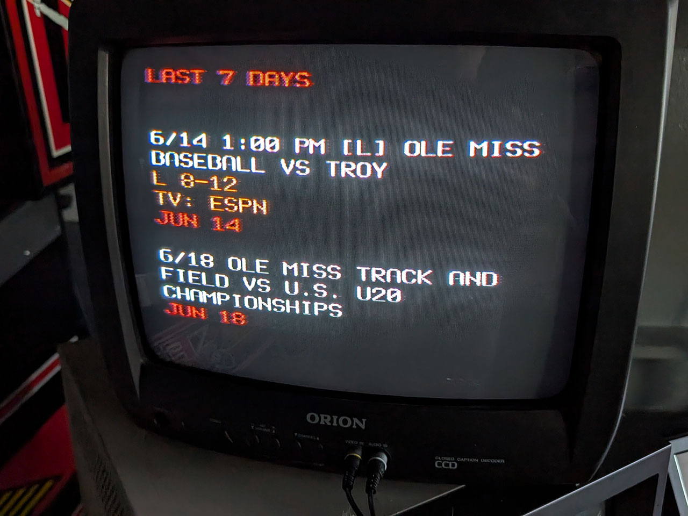
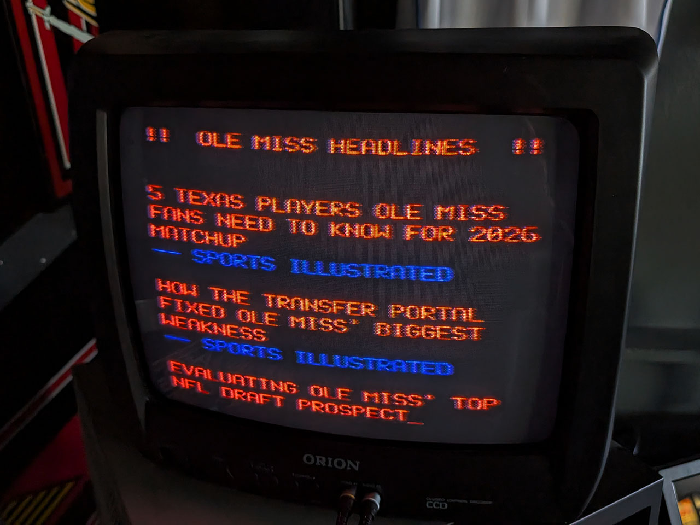

# RetroFeed: CRT Ole Miss / SEC Edition

A vintage-style news terminal built on a Raspberry Pi, displaying live Ole Miss and SEC football updates, college football rankings, and news headlines on an old CRT television over composite (RCA) output.



This project is a heavily customized fork of [RetroFeed](https://github.com/JeffJetton/retrofeed) by Jeff Jetton, which scrolls plain ASCII text up the screen in the style of Don Lancaster's TV Typewriter. The original handles general news/weather/finance segments — this version replaces and extends that with Ole Miss and SEC-specific content, a custom font/display pipeline tuned for CRT output, and original sound effects.

## What's different from the original

- **Ole Miss / SEC segments**: Ole Miss football scores and schedule (pulled via ICS/Google Calendar), SEC football roundup, Pete Golding news, CFB rankings, AP Top 25, ESPN College Football, and custom Ole Miss ASCII art
- **Custom CRT display pipeline**: switched from the KMS driver to the legacy `fbcon` framebuffer driver for reliable text rendering on composite output, using a chunky Terminus Bold font scaled to a 26x15 character grid
- **Inline color switching**: `display.py` includes a `set_color()` method for ANSI color control, with a distinct color scheme per segment (green for loading, red/blue for Ole Miss, magenta for AP Top 25, cyan for NYT News, etc.)
- **Custom audio**: a dot-matrix-style click sound effect generated with Python's `wave` module

## Hardware

- Raspberry Pi 3B+ (64-bit Raspberry Pi OS)
- CRT television, connected via composite/RCA
- (Optional) SSH access for remote development



## Setup

### 1. Flash Raspberry Pi OS

Use the 64-bit version of Raspberry Pi OS. The 32-bit (`armv7l`) build will not work if you plan to use VS Code Remote-SSH for development — VS Code Server requires 64-bit.

### 2. Install dependencies

```bash
pip install beautifulsoup4 requests
```

### 3. Configure the framebuffer for CRT output

Edit `/boot/firmware/config.txt` (or `/boot/config.txt` on older OS versions):

- Comment out the KMS driver line (`dtoverlay=vc4-kms-v3d`) — it's incompatible with the legacy framebuffer approach used here
- Set:
  ```
  framebuffer_width=312
  framebuffer_height=360
  ```
  This produces a 26-column x 15-row character grid scaled to fill the CRT.

### 4. Install the CRT font

This project uses `Uni2-TerminusBold24x12.psf.gz` for a chunky, readable look on composite output.

```bash
sudo setfont Uni2-TerminusBold24x12.psf.gz
```

To make this persist across boots, add the `setfont` command to `~/.bashrc` so it runs automatically on `tty1`. You'll also need a sudoers exception so it can run without a password prompt — see `CRT_SETUP_NOTES.md` for the exact configuration.

### 5. Run it

```bash
python retrofeed.py
```

For iterative development/testing without rebooting:

```bash
pkill -f retrofeed.py && python retrofeed.py
```

## Configuration

Segment order, timing, and which segments are active are controlled via `config.toml`. See `segments/` for individual segment modules — each follows the pattern in `segments/template.py`.

## Credits

- Built on [RetroFeed](https://github.com/JeffJetton/retrofeed) by Jeff Jetton (MIT License — see `LICENSE`)
- CRT/font/framebuffer configuration details in `CRT_SETUP_NOTES.md`

## License

MIT — see `LICENSE`. Original copyright retained per the terms of the upstream RetroFeed project.# RetroFeed

Use a Raspberry Pi to display weather, news, and other information, on a composite monitor... vintage style!


